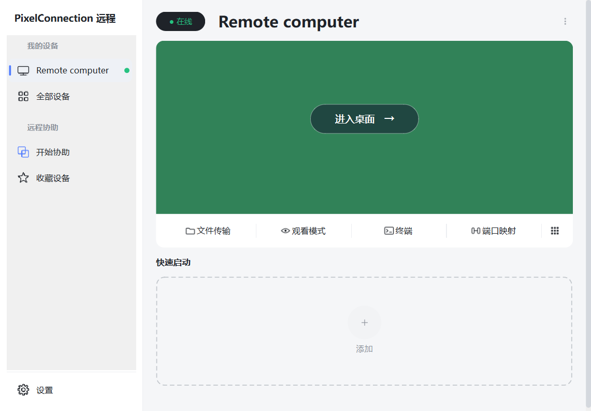
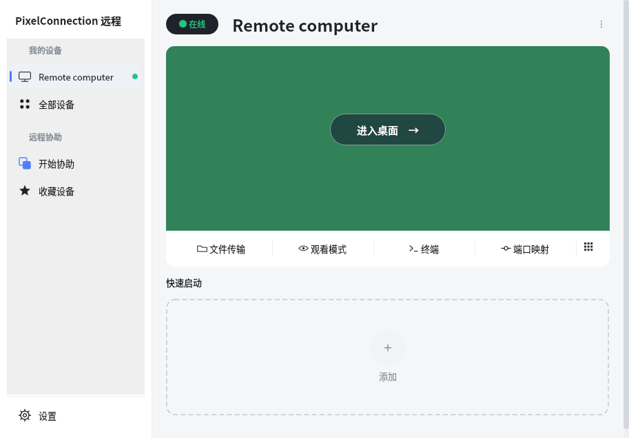
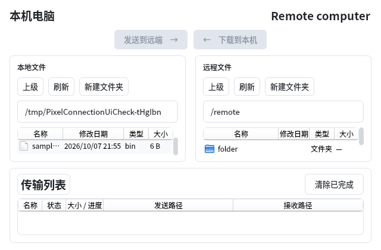
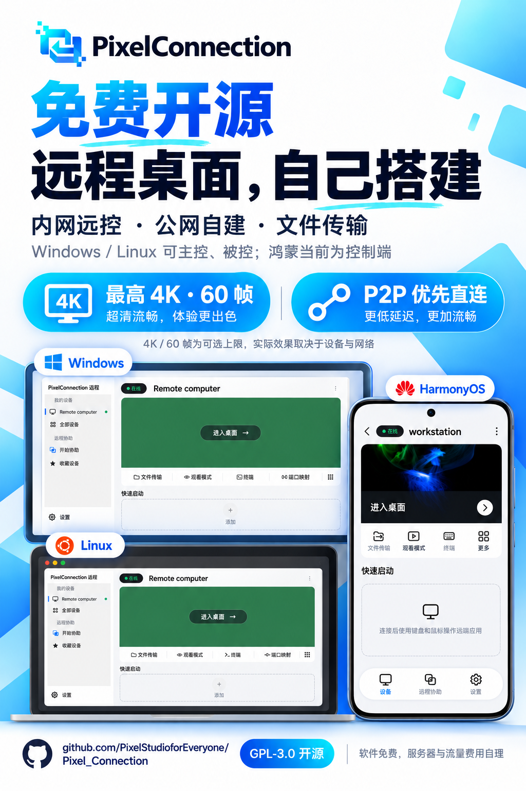

# PixelConnection


**简体中文** · [English](README_EN.md)

**免费开源、可自行搭建的跨端远程桌面。** Windows、Linux 与 HarmonyOS 共用账号、设备身份和连接协议。源码采用 **GPL-3.0-only**；服务器、域名及流量费用由部署者承担。

**最高 4K · 60 帧配置，P2P 优先直连。** 画质与帧率为可选上限，实际效果取决于被控屏幕、设备与网络。

[GitHub 仓库](https://github.com/PixelStudioforEveryone/Pixel_Connection) · [服务器构建](docs/SERVER_BUILD.md) · [三端客户端构建](docs/CLIENT_BUILD.md) · [内网与公网使用](docs/USAGE.md) · [安全说明](SECURITY.md)

[下载安装包](https://github.com/PixelStudioforEveryone/Pixel_Connection/releases) · [安装说明](docs/DOWNLOADS.md) · [鸿蒙 Pixel远程发布准备](Pixel_Connection_HOS/RELEASE.md)

## 界面预览

Windows 与 Linux 采用一致的侧栏和设备详情布局：选择设备后可查看壁纸预览，进入桌面或独立打开文件传输。

| Windows | Linux / Ubuntu |
|---|---|
|  |  |

文件传输提供本地／远端双栏目录和任务列表；未选中文件时，发送与下载按钮保持禁用。



以上为使用演示设备、测试壁纸和临时文件捕获的应用界面，展示布局，不代表传输速度或公网性能。截图中的部分预留入口尚未实现，功能范围见下方说明。

<details>
<summary>查看 Windows、Linux 与 HarmonyOS 三端宣传图</summary>



宣传图使用应用界面参考生成，属于视觉介绍；实际界面请参考上方截图和当前构建。HarmonyOS 手机／大屏目前作为控制端。

</details>

## 三端支持

| 平台 | 控制其他设备 | 被远程控制 | 文件传输 | 本机账号／信令服务 |
|---|---|---|---|---|
| Windows | 支持 | 支持 | 支持 | 支持 |
| Linux | 支持 | 支持，含 X11 与 GNOME Wayland | 支持 | 支持 |
| HarmonyOS 手机／大屏 | 支持 | 当前不支持 | 支持，受应用文件访问范围限制 | 当前不支持 |

已实现桌面画面、键鼠与触摸、多屏切换、画质／帧率选择、硬件／软件／智能加速、双向文件传输和纯文本剪贴板。鸿蒙提供系统键盘、分页电脑键盘、虚拟鼠标及手机／大屏控制面板。

设备卡片展示被控端壁纸；PC 被控状态下禁用出站控制。文件传输模式独立打开。账号／信令支持 IPv4／IPv6，数据优先 P2P，无法直连时使用认证 TURN UDP。

目前不支持 macOS／iOS 客户端、鸿蒙被控桌面、端口映射、图片／富文本剪贴板和 TURN TCP／TLS。移动网络应实际验证画面、输入及文件，登录成功不代表全部链路可用。

## 内网快速使用

1. 一台 Windows／Linux 在登录页打开服务器设置，选择“使用本机服务器”，启动服务。
2. 将分享窗口的两条地址复制到其他设备。例如 API `http://192.168.1.10:29910`、信令 `ws://192.168.1.10:9910`；这里的 IP 只是示例。
3. 在该服务器注册，各端登录同一账号并将本机加入设备列表。
4. 选择在线 PC，输入被控端验证码，进入桌面或文件传输。

其他设备不能用 `127.0.0.1` 连接服务器。服务主机放行 TCP 29910／9910 并保持运行。内网无需购买云服务器，画面和文件通常由两端直传。

## 公网远程使用

自行部署账号／信令后端、HTTPS／WSS 网关及必要的 coturn 中继，各端填写自己的服务器地址：

```text
账号 API：https://remote.example.com
信令：wss://remote.example.com/signal
TURN：turn://remote.example.com:3478
```

示例域名不能直接使用。TURN 用户名和随机密码由部署者生成并填入网络设置。账号／信令协商连接，画面与文件优先直连，受 NAT 限制时经 TURN 转发。完整步骤见 [SERVER_BUILD.md](docs/SERVER_BUILD.md)。

## 源码结构

```text
apps/client/                 Windows／Linux Qt 客户端
src/ 与 include/pxc/         三端共享 C++ 核心与 PC 平台实现
server/                      账号 API、SQLite 与 WebSocket 信令
Pixel_Connection_HOS/        HarmonyOS ArkTS UI、NAPI 与原生解码
deploy/                      网关、中继和服务管理模板
docs/                        构建与使用说明，含配图
tests/                       密码、会话认证和视频协议测试
```

无界面服务器不需要 Qt：

```bash
cmake -S . -B build -DPXC_BUILD_QT_CLIENT=OFF -DPXC_BUILD_STANDALONE_SERVER=ON
cmake --build build --target pxc-server -j
```

PC 客户端开启 `PXC_BUILD_QT_CLIENT=ON`。服务集成到 `pxc-client --server`，客户端安装包无需另附服务器 exe。首次配置下载依赖，HarmonyOS OpenSSL 静态库自行交叉编译，见 [CLIENT_BUILD.md](docs/CLIENT_BUILD.md)。

## 凭据与许可证

仓库不提供共用账号、服务器密码、SSH 密钥或鸿蒙签名证书。设备身份在本机生成，部署和签名材料自行准备并保存在源码之外。公开 CA 根证书只用于验证 HTTPS／WSS，附来源与许可。

运行数据库、身份、签名、构建、私有配置和开发日志由 .gitignore 排除。公开提交使用经过扫描的源码快照，不携带原开发目录的 Git 历史。

原创代码采用 [GNU GPL v3.0 only](LICENSE)。依赖保留各自许可，见 [THIRD_PARTY_NOTICES.md](THIRD_PARTY_NOTICES.md)。
